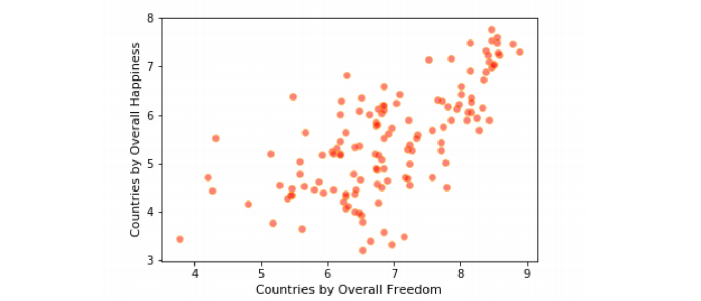
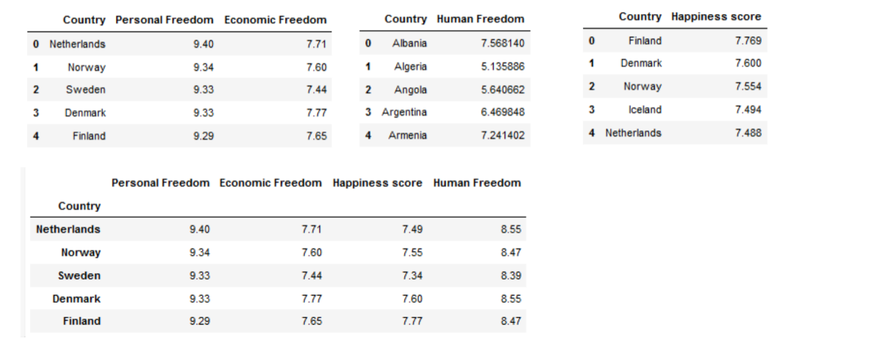
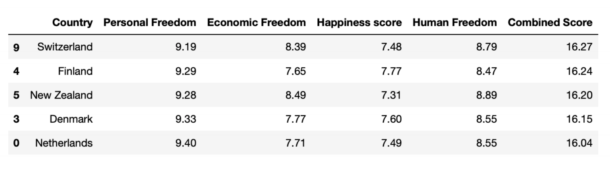
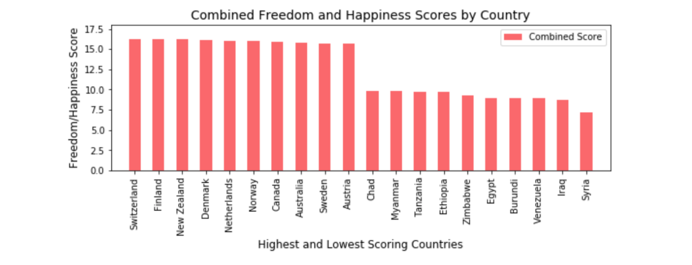
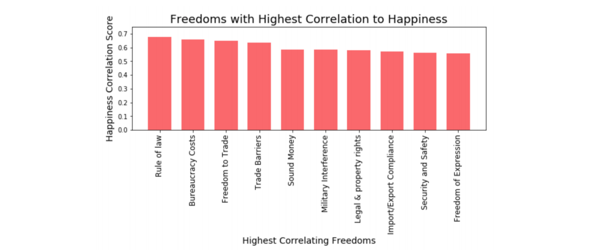

# Does Freedom Equal Happiness? | A Data Exploration
### Data Presentation @ link: https://bit.ly/2kVEZLp

## Project Description: 

#### In this project we compare and contrast a data set from the Human Freedom Index with a data set from the World Happiness Report, exploring the relationship between freedom and happiness. 

  * Original inspiration for this exploration: is it possible to use data science to explore subjective or qualitative ideas such as happiness, and come up with meaningful, actionable insights? 
  * Motivation: Secondary thought question: if we were benevolent world leaders, what would be the factors we could address that would have the most impact on humanity's overall well-being? 

### Hypothesis:

We expect to find that the freedom index and the happiness index correlate with one another, and that some forms of freedom have a higher correlation with happiness than others. 

### Data Sets:

* World Happiness Report (2019) https://worldhappiness.report/ed/2019/#read 
* Human Freedom Index Dataset 1 (2018) https://www.cato.org/human-freedom-index-new 
* Human Freedom Index Dataset 2 (2018) https://www.kaggle.com/gsutters/the-human-freedom-index#hfi_cc_2018.csv 

### Data tools used:

* Jupyter Notebook
* Pandas
* Numpy
* Matplotlib
* Seaborn

### Research Questions:

**Q1:** Compare the two datasets to find top countries based on combined happiness/freedom metrics. What are the countries with the highest and lowest scores?

**Q2:** Do personal freedom and economic freedom correlate equally with happiness, or is there a difference between the two? If there is a difference, which freedom has a higher correlation with happiness? 

**Q3:** If there is a “winning” freedom, compare it with the happiness index to determine which variables inside that freedom have the highest impact on happiness.

## Project Steps: data exploration and analysis

### 1. Plotted freedom and happiness scores to look for overall correlation/relationship
#### *Freedom and Happiness plotted by country: Appears to be a correlation...*

### 2. Merged datasets for a combined “freedom+happiness” score...

### 3. ...and sorted by combined scores

### 4. Plotted highest- and lowest-scoring countries 
I concatenated the head and tail of the combined/sorted dataframe and plotted using matplotlib to visualize the top-10 (and bottom-10) scoring countries: 

### 5. Found the "winning" freedom: 
#### What matters more to happiness -- personal freedom or economic freedom?

#### WHAT WE DID: 
* Ran Spearman Rho and Kendall Tau analyses on each sub-category of economic freedom. 
* Ran the same tests on personal freedom sub-categories, just to see if one of them were #1 overall 
#### RESULTS:
The two tests produced similar results. We found that Rule of Law is the sub-category that most correlates with Happiness Scores. That is listed as a personal freedom. However, as we might expect given the findings from Question 2, economic freedoms dominate the Top Ten. P-Values from Spearman Rho for the top 5 factors ranged from 3.91e-19 to 1.08e-13. Correlation result for top 5 factors ranged from 0.675 to 0.586 

#### The Upshot: Freedoms that correlate most with happiness Economic freedoms dominate the top ten: 

## Post Mortem: conclusions and future questions

### Inferences or general conclusions drawn from initial analysis:
* Basically, we found what we expected to find. We expected to see a correlation between freedom and happiness, and to see a degree of difference between highest and lowest scoring countries. 
* Regional patterns, ex: highest-ranking countries concentrated in Scandinavia and Northern Europe 
* Lowest scores in some countries experiencing (or that have experienced) some political/economic instability; we could assume that’s a contributing factor...but is it? 
* There does appear to be a correlation between freedom and happiness 

### Overall conclusions: 
* Economic Freedom tentatively correlates more strongly with happiness than personal freedom 
* The “top ten” correlating freedoms are somewhat surprising, relating to law, trade, money, etc. rather than personal and social freedoms one might expect as they are so highly regarded in our society. Related to this: as an example, Syria ranked last on each Top 5 correlating freedom, but was not last in overall happiness score. 

### What we would research next, if we had two more weeks? 
* To help ourselves be benevolent rulers, we would need to drill down into the “winning” freedoms and determine what they’re made of, to be able to recommend policy decisions for highest benefit. 
* Research the countries with highest combined scores to parse out any statistically significant relationships within those combinations. 
* Focus on the United States, to see if the correlating freedoms rank similarly. 
